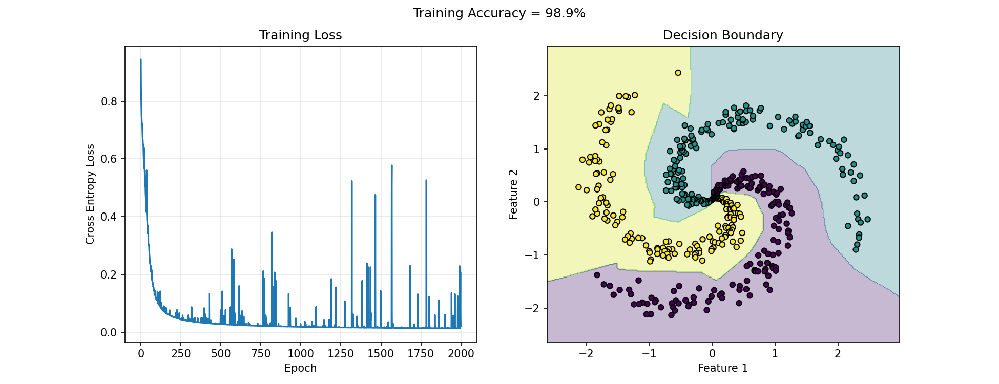

# 3-Layer Neural Network from Scratch (NumPy)

## Overview
This project implements a **3-layer Neural Network** using only **NumPy**, without using Keras or PyTorch.

## Features
- Pure NumPy implementation
- Forward Propagation
- Backpropagation
- ReLU Activation
- Softmax Output Layer
- Cross Entropy Loss
- Mini-Batch Gradient Descent
- Spiral Dataset
- Decision Boundary Visualization

## Project Structure

```
three_layer_nn.py
nn_results.png
README.md
requirements.txt
```

## Requirements

- Python 3.x
- NumPy
- Matplotlib

## Installation

```bash
pip install -r requirements.txt
```

## Run the Project

```bash
python three_layer_nn.py
```

## Output

The project generates:

- Training Loss graph
- Decision Boundary plot
- Training Accuracy

### Training Results

